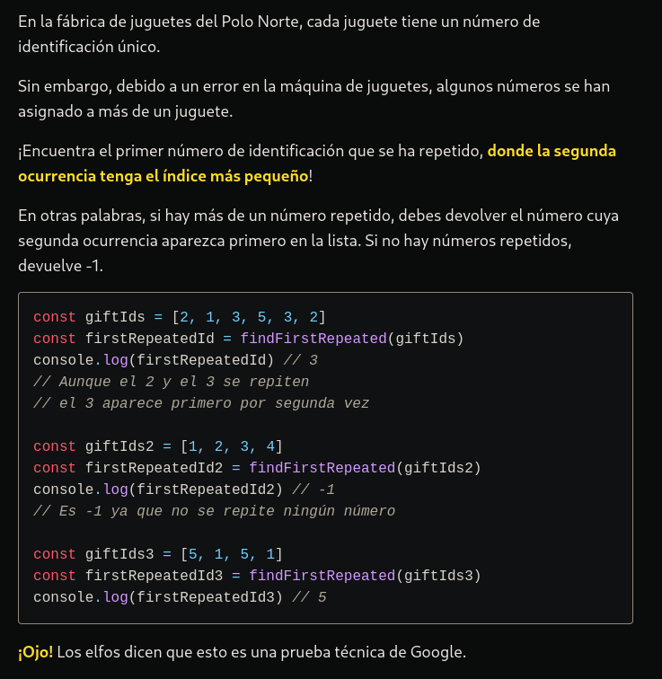

# LA RESOLUCIÓN DEL PROBLEMA Y EXPLICANDOLO UN POCO MAS A DETALLE.

```typescript
//Esta es una mejor version del codigo anterior//

// Esta función encuentra el primer regalo repetido en una lista de regalos.
function findFirstRepeated(gifts: number[]): number {
  // Crear un mapa para almacenar los índices de los regalos que se han encontrado
  const giftIndices = new Map<number, number>();

  // Inicializar el índice actual
  let index = 0;

  // Iterar a través de la lista de regalos
  for (const currentGift of gifts) {
    // Verificar si el regalo actual ya ha sido encontrado antes
    if (giftIndices.has(currentGift)) {
      // Si sí, devolver el regalo repetido
      return currentGift;
    } else {
      // Si no, almacenar el índice del regalo actual en el mapa
      giftIndices.set(currentGift, index);
    }

    // Incrementar el índice para el siguiente regalo
    index++;
  }

  // Si no se encuentra ningún regalo repetido, devolver -1
  return -1;
}


La función `findFirstRepeated` toma un array de números llamado `gifts` como parámetro y devuelve el primer número que se repite en el array. Si no hay ningún número repetido, la función devuelve -1.

Ahora, desglosemos el código paso a paso:

1. `const giftIndices = new Map<number, number>();`: Se crea un nuevo objeto `Map` llamado `giftIndices`. Este mapa se utiliza para realizar un seguimiento de los índices en los que se ha visto cada regalo en el array.

2. `let index = 0;`: Se inicializa una variable `index` con 0. Esta variable se utilizará para llevar un seguimiento del índice actual mientras se recorre el array.

3. `for (const currentGift of gifts) {`: Se inicia un bucle `for...of` que recorre cada elemento del array `gifts`. En cada iteración, el elemento actual se almacena en la variable `currentGift`.

4. `if (giftIndices.has(currentGift)) { return currentGift; }`: Dentro del bucle, se verifica si el regalo actual (`currentGift`) ya está presente en el mapa `giftIndices`. Si es así, significa que este regalo se ha visto antes, y la función devuelve ese regalo, ya que es el primer regalo repetido encontrado.

5. `else { giftIndices.set(currentGift, index); }`: Si el regalo actual no está presente en el mapa, se añade al mapa con la clave como el regalo actual y el valor como el índice actual. Esto significa que se está registrando la primera vez que se ve este regalo y en qué posición del array se encuentra.

6. `index++;`: Se incrementa el índice para el siguiente elemento del array.

7. Después de completar el bucle, si no se ha encontrado ningún regalo repetido, la función devuelve -1.

En resumen, la función utiliza un mapa para llevar un seguimiento de los regalos vistos y sus índices en el array. Al encontrar un regalo que ya ha sido registrado en el mapa, la función devuelve ese regalo como el primero que se repite. Si no se encuentra ningún regalo repetido, devuelve -1.


----------------------------------------------------------************************************--------------------------------------------------

// La función findFirstRepeated encuentra el primer regalo repetido en un array de regalos.
function findFirstRepeated(gifts: number[]): number {
  // Mapa para almacenar el índice de cada regalo.
  const giftIndices = new Map<number, number>();

  // Iterar sobre el array de regalos.
  for (let currentIndex = 0; currentIndex < gifts.length; currentIndex++) {
    const currentGift = gifts[currentIndex];

    // Verificar si el regalo ya ha sido encontrado.
    if (giftIndices.has(currentGift)) {
      // Devolver el valor del primer regalo repetido.
      return currentGift;
    } else {
      // Almacenar el índice del regalo actual en el mapa.
      giftIndices.set(currentGift, currentIndex);
    }
  }

  // Devolver -1 si no se encuentra ningún regalo repetido.
  return -1;
}

// Ejemplo de uso:
const gifts = [2, 1, 3, 5, 3, 2];
const result = findFirstRepeated(gifts);

// Mostrar el resultado en la consola (puedes ajustar esta parte según tus necesidades).
console.log(result);


esta es la explicasion al segundo codigo:


para poder llegar a la conclusion de estee desafio lo dividi en pasos para ver el panorama completo emnpece con.

Comentario de función: Se proporciona un comentario que explica el propósito de la función findFirstRepeated.

Mapa de Índices: Se utiliza un Map llamado giftIndices para almacenar el índice de cada regalo que se encuentra durante la iteración.

Iteración sobre Regalos: Se utiliza un bucle for para iterar sobre cada regalo en el array.

Verificación de Regalo Repetido: En cada iteración, se verifica si el regalo actual ya ha sido encontrado antes utilizando el método has del mapa.

Devolver el Valor del Regalo Repetido: Si se encuentra un regalo repetido, la función devuelve el valor del regalo actual.

Almacenar Índice en el Mapa: Si el regalo no ha sido encontrado antes, se almacena el índice actual del regalo en el mapa.

Devolver -1 si no hay Regalos Repetidos: Si no se encuentra ningún regalo repetido, la función devuelve -1.

Ejemplo de Uso: Se proporciona un ejemplo de cómo usar la función con un array de regalos y se almacena el resultado en la variable result.

Mostrar Resultado en la Consola: Se imprime el resultado en la consola. Puedes adaptar esta parte según tus necesidades, por ejemplo, puedes utilizar el resultado de otra manera o mostrarlo de manera diferente en tu aplicación.

Este código proporciona una función simple para encontrar el primer regalo repetido en un array, y el ejemplo de uso muestra cómo aplicar la función a un caso específico. Puedes incorporar este código y su explicación en tu README de GitHub para que otros desarrolladores entiendan cómo usar la función findFirstRepeated.
