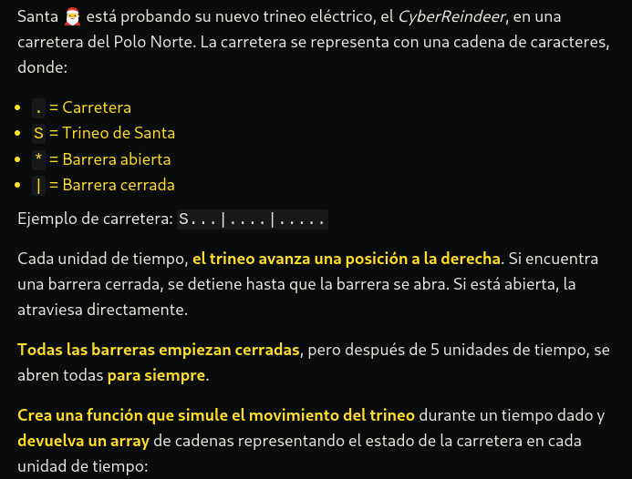
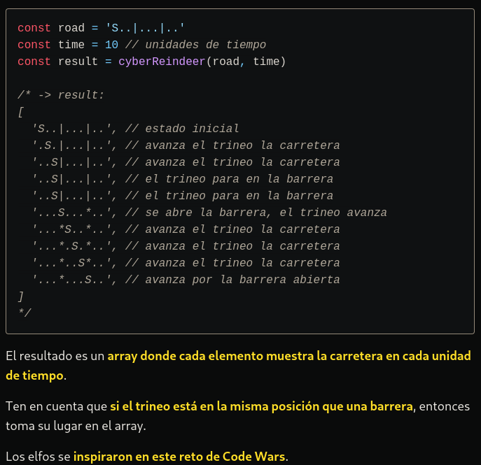

# LA RESOLUCIÓN DEL PROBLEMA Y EXPLICANDOLO UN POCO MAS A DETALLE.

function cyberReindeer(road: string, time: number): string[] {
  const snapshots: string[] = [road];
  let lastChar: string = '.';

  for (let iteration: number = 1; iteration < time; iteration++) {
    if (iteration === 5) {
      road = road.replace(/\|/g, '*');
    }

    const matches: RegExpMatchArray | null = road.match(/S[\*\.]/g);

    if (matches) {
      road = road.replace(matches[0], lastChar + 'S');
      lastChar = matches[0][1];
    }

    snapshots.push(road);
  }

  return snapshots;
}


Veamos el código paso a paso y luego veras un resumen de cómo llege a esa solución:

```typescript
// La función simula el movimiento de un "reindeer" (reno) a lo largo de una carretera.
function cyberReindeer(road: string, time: number): string[] {
  // Array que almacenará instantáneas de la carretera en cada iteración.
  const snapshots: string[] = [road];

  // Variable que guarda el último carácter procesado. Inicializado con '.'.
  let lastChar: string = '.';

  // Bucle de iteración que simula el paso del tiempo.
  for (let iteration: number = 1; iteration < time; iteration++) {
    // En la iteración 5, se reemplazan todas las barras verticales ('|') con asteriscos ('*').
    if (iteration === 5) {
      road = road.replaceAll('|', '*');
    }

    // Se busca el patrón "S" seguido por un punto o un asterisco en la cadena.
    const matches: RegExpMatchArray | null = road.match(/S[\*\.]/g);

    // Si se encuentran coincidencias, se realiza un movimiento de "S" a la izquierda.
    if (matches) {
      road = road.replace(matches[0], lastChar + 'S');
      lastChar = matches[0][1];
    }

    // Se almacena la instantánea de la carretera en el array.
    snapshots.push(road);
  }

  // Se devuelve el array de instantáneas de la carretera a lo largo del tiempo.
  return snapshots;
}

Una Explaicasion mas profunda seria:

### Función `cyberReindeer`

La función `cyberReindeer` simula el movimiento de un reno a lo largo de una carretera durante un número específico de iteraciones.

```typescript
function cyberReindeer(road: string, time: number): string[] {
```

#### Variables iniciales:

```typescript
  // Array que almacenará instantáneas de la carretera en cada iteración.
  const snapshots: string[] = [road];

  // Variable que guarda el último carácter procesado. Inicializado con '.'.
  let lastChar: string = '.';
```

### Bucle de iteración:

```typescript
  // Bucle de iteración que simula el paso del tiempo.
  for (let iteration: number = 1; iteration < time; iteration++) {
```

#### Cambio en la iteración 5:

```typescript
    // En la iteración 5, se reemplazan todas las barras verticales ('|') con asteriscos ('*').
    if (iteration === 5) {
      road = road.replace(/\|/g, '*');
    }
```

#### Proceso de movimiento de "S":

```typescript
    // Se busca el patrón "S" seguido por un punto o un asterisco en la cadena.
    const matches: RegExpMatchArray | null = road.match(/S[\*\.]/g);

    // Si se encuentran coincidencias, se realiza un movimiento de "S" a la izquierda.
    if (matches) {
      road = road.replace(matches[0], lastChar + 'S');
      lastChar = matches[0][1];
    }
```

#### Almacenamiento de instantáneas:

```typescript
    // Se almacena la instantánea de la carretera en el array.
    snapshots.push(road);
  }
```

### Resultado final:

```typescript
  // Se devuelve el array de instantáneas de la carretera a lo largo del tiempo.
  return snapshots;
}
```

### Resumen:

1. **Definición de la función:** Se especifica que la función toma una cadena `road` y un número `time`, y devuelve un array de strings (`string[]`).
2. **Variables iniciales:** Se inicializan las variables `snapshots` y `lastChar`.
3. **Bucle de iteración:** Se utiliza un bucle `for` para simular el paso del tiempo durante un número específico de iteraciones.
4. **Cambio en la iteración 5:** En la iteración 5, se reemplazan todas las barras verticales (`|`) con asteriscos (`*`) en la cadena `road`.
5. **Proceso de movimiento de "S":** Se busca el patrón "S" seguido por un punto o un asterisco en la cadena, y se realiza un movimiento de "S" a la izquierda.
6. **Almacenamiento de instantáneas:** En cada iteración, la cadena modificada `road` se agrega al array `snapshots`.
7. **Resultado final:** La función devuelve el array de instantáneas de la carretera a lo largo del tiempo.
