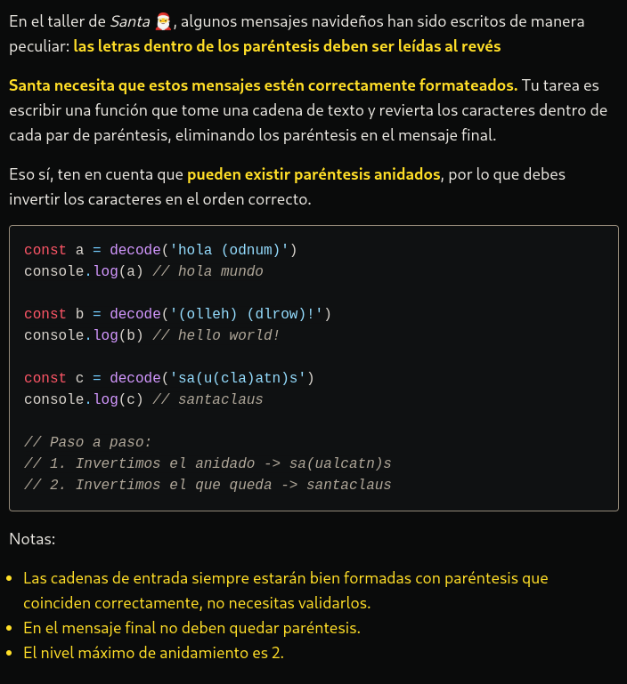

# LA RESOLUCIÓN DEL PROBLEMA Y EXPLICANDOLO UN POCO MAS A DETALLE.

Veamos el código paso a paso y luego veras un resumen de cómo llege a esa solución:

```typescript
function decode(message: string): string {
  // Definir una función para revertir una cadena
  function reverseString(str: string): string {
    return str.split('').reverse().join('');
  }

  // Inicializar una pila para manejar los paréntesis
  const stack: string[] = [];
  // Inicializar la cadena de resultado
  let result = '';

  // Iterar sobre cada carácter en el mensaje
  for (const char of message) {
    if (char === '(') {
      // Si el carácter es '(', empujar el resultado actual a la pila y reiniciar el resultado
      stack.push(result);
      result = '';
    } else if (char === ')') {
      // Si el carácter es ')', revertir el resultado actual y combinarlo con el último resultado almacenado en la pila
      result = reverseString(result);
      result = stack.pop() + result;
    } else {
      // Si el carácter no es un paréntesis, simplemente agregarlo al resultado actual
      result += char;
    }
  }

  // Devolver el resultado final
  return result;
}


Resumen de la solución:

1. La función `decode` toma un mensaje codificado como entrada.
2. Se define una función interna `reverseString` para revertir una cadena.
3. Se inicializa una pila (`stack`) para manejar los paréntesis y una cadena de resultado (`result`).
4. Se itera sobre cada carácter en el mensaje.
5. Si el carácter es '(', se empuja el resultado actual a la pila y se reinicia el resultado.
6. Si el carácter es ')', se revierte el resultado actual y se combina con el último resultado almacenado en la pila.
7. Si el carácter no es un paréntesis, se agrega al resultado actual.
8. Al final, se devuelve el resultado final.

En resumen, la función decodifica un mensaje que ha sido codificado de una manera específica. Se utiliza una pila para realizar un seguimiento de los resultados parciales mientras se encuentran paréntesis, y se revierten las secciones de texto cuando se encuentran paréntesis de cierre.
