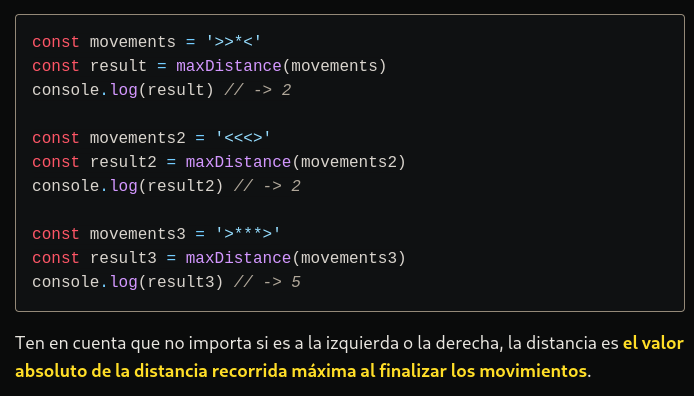

# LA RESOLUCIÓN DEL PROBLEMA Y EXPLICANDOLO UN POCO MAS A DETALLE.

```typescript

La función `maxDistance` toma una cadena de movimientos (`movements`) como entrada y devuelve un número. Esta cadena de movimientos representa una serie de instrucciones, donde cada carácter puede ser `'>'`, `'<'`, o `'*'`.

- `let distance = 0;` y `let wildCard = 0;`: Se inicializan dos variables, `distance` para rastrear la distancia y `wildCard` para contar el número de comodines (`*`).

- `for (const signo of movements) {`: Inicia un bucle que recorre cada carácter de la cadena `movements`.

  - `if (signo === '>') distance++;`: Si el carácter es `'>'`, incrementa la variable `distance`.
  - `else if (signo === '<') distance--;`: Si el carácter es `'<'`, decrementa la variable `distance`.
  - `else if (signo === '*') wildCard++;`: Si el carácter es `'*'`, incrementa la variable `wildCard`.

- `return Math.abs(distance) + wildCard;`: Finalmente, se calcula la distancia total sumando el valor absoluto de `distance` (para ignorar la dirección) y el número de comodines `wildCard`. Este valor se devuelve como resultado de la función.

En resumen, la función recorre la cadena de movimientos, actualiza la distancia basándose en los caracteres `'>'` y `'<'`, cuenta el número de comodines (`'*'`), y devuelve la distancia total considerando tanto los movimientos como los comodines. La función está diseñada para ser clara y concisa, y su propósito es calcular la distancia final a partir de una secuencia de movimientos y comodines.
