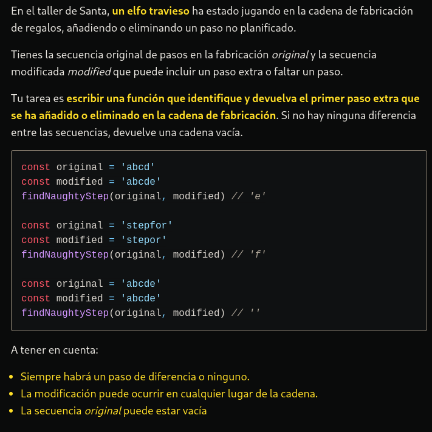

# LA RESOLUCIÓN DEL PROBLEMA Y EXPLICANDOLO UN POCO MAS A DETALLE.


```typescript
function findNaughtyStep(original: string, modified: string): string {
  // Paso 1: Función y parámetros
  // La función toma dos cadenas de texto y devuelve una cadena de texto
  const lenOriginal: number = original.length;
  const lenModified: number = modified.length;

  // Paso 2: Longitudes de las cadenas
  // Se obtienen las longitudes de las cadenas de entrada y se almacenan
  // en las variables lenOriginal y lenModified
  const minLength: number = Math.min(lenOriginal, lenModified);

  // Paso 3: Longitud mínima
  // Se calcula la longitud mínima entre las dos cadenas
  // para evitar desbordamientos de índices al comparar
  // las cadenas
  // Paso 4: Comparación de pasos
  // Se utiliza un bucle para iterar a través de los pasos
  // de ambas cadenas hasta la longitud mínima
  for (let i = 0; i < minLength; i++) {
    // Si se encuentra un paso diferente, se determina cuál
    // es el "paso travieso" comparando las longitudes de las cadenas
    // y se devuelve ese paso
    if (original[i] !== modified[i]) {
      return lenOriginal < lenModified ? modified[i] : original[i];
    }
  }

  // Paso 5: Paso extra o faltante
  // Si una cadena es más larga que la otra, significa que hay
  // un paso extra o faltante. Se devuelve el primer paso de la
  // porción adicional usando slice
  if (lenOriginal < lenModified) {
    return modified.slice(minLength)[0];
  } else if (lenOriginal > lenModified) {
    return original.slice(minLength)[0];
  }

  // Paso 6: Igualdad de secuencias
  // Si ninguna diferencia se encuentra en el bucle y las longitudes
  // de ambas cadenas son iguales, entonces las cadenas son idénticas
  // y se devuelve una cadena vacía
  return '';
}
```

**Resumen:**
La función `findNaughtyStep` compara dos cadenas de texto (`original` y `modified`) y encuentra el primer carácter diferente entre ellas. Si una cadena es más corta que la otra, devuelve el primer carácter adicional o faltante. Si no hay diferencias y las cadenas son de igual longitud, devuelve una cadena vacía.
